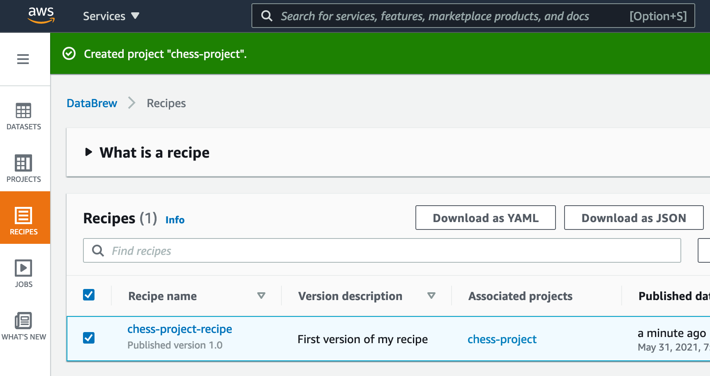
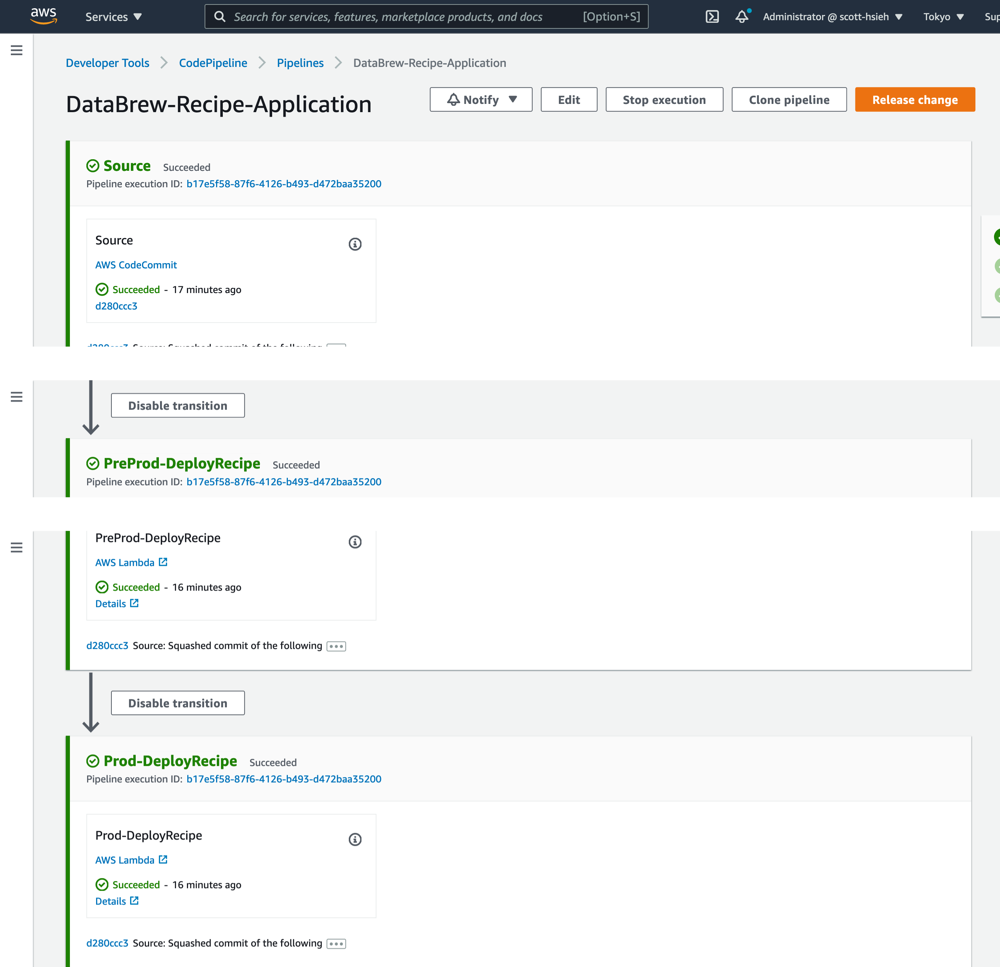
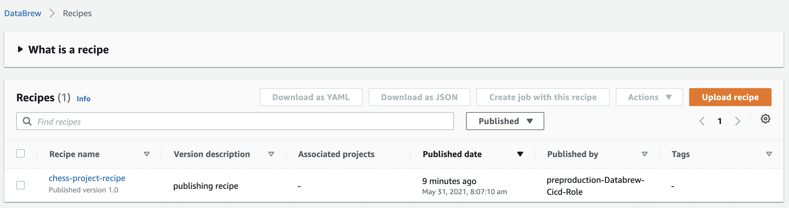
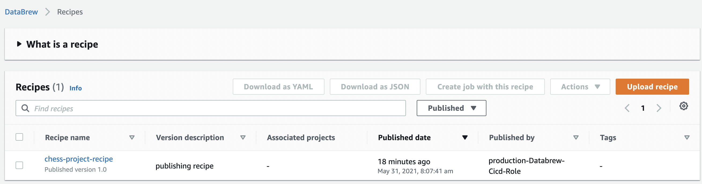

# cdk-databrew-cicd
A demonstration of CICD with AWS Databrew

## Some Efforts after Stack Creation  
### CodeCommit  
1. Create HTTPS Git credentials for AWS CodeCommit with an IAM user that you're going to use.  
  
2. Run through the steps noted on the README.md of the CodeCommit repository after finishing establishing the stack via CDK. The returned message with success should be looked like the following (assume you have installed [`git-remote-codecommit`](https://pypi.org/project/git-remote-codecommit/)):  
   ```bash
   $ git clone codecommit://scott.codecommit@DataBrew-Recipes-Repo
   Cloning into 'DataBrew-Recipes-Repo'...
   remote: Counting objects: 6, done.
   Unpacking objects: 100% (6/6), 2.03 KiB | 138.00 KiB/s, done.
   ```  
3. Add a DataBrew recipe into the local repositroy (directory) and commit the change. (either directly on the main branch or merging another branch into the main branch)  

### Glue DataBrew  
1. Download any recipe either generated out by following [*Getting started with AWS Glue DataBrew*](https://docs.aws.amazon.com/zh_tw/databrew/latest/dg/getting-started.html) or made by yourself as **JSON file**.  
     
2. Move the recipe from the download directory to the local directory for the CodeCommit repository.   
   ```bash
   $ mv ${DOWNLOAD_DIRECTORY}/chess-project-recipe.json ${CODECOMMIT_LOCAL_DIRECTORY}/
   ```
3. Commit the change to a branch with a name you prefer. 
   ```bash
   $ cd ${{CODECOMMIT_LOCAL_DIRECTORY}}
   $ git checkout -b add-recipe main
   $ git add .
   $ git commit -m "first recipe"
   $ git push --set-upstream origin add-recipe
   ```
4. Merge the branch into the main branch. Just go to the **AWS CodeCommit** web console to do the merge as its process is purely the same as you've already done thousands of times on **Github** but only with different UIs.  

## How Successful Commits Look Like  
1. In the infrastructure account, the status of the CodePipeline DataBrew pipeline should be similar as the following:  
     
1. In the **pre-production** account with the same region as where the CICD pipeline is deployed at the infrastructue account, you'll see this.  
     
2. In the **production** account with the same region as where the CICD pipeline is deployed at the infrastructue account, you'll see this.   
     

